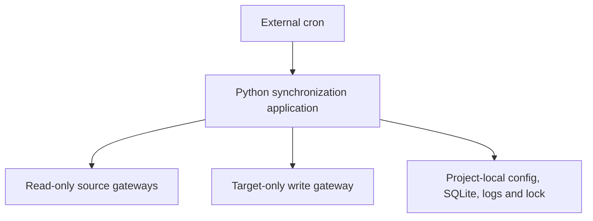

# Nextcloud Calendar Location Mirror

## Technical Specification

**Version:** 1.0  
**Language:** English  
**Target runtime:** Python on STRATO shared webspace  
**Calendar service:** Nextcloud hosted at IONOS

## 1. Purpose

The application is a periodically executed Python batch process that maintains one Nextcloud target calendar from multiple Nextcloud source calendars.

Only event occurrences whose effective `LOCATION` matches one of several configured locations are mirrored. The target calendar is a derived view: new eligible events are created, changed events are updated, and managed target entries are deleted when the corresponding source event is deleted, cancelled, moved outside the synchronization scope, or no longer has an eligible location.

Location transitions are first-class synchronization changes:

- ineligible location to eligible location: create the target occurrence;
- eligible location to another eligible location: update the target occurrence;
- eligible location to ineligible or empty location: delete the target occurrence;
- the same rules apply to exceptions in recurring series.

Source calendars are never modified. The actual cron configuration and cron command are outside the scope of this specification.

## 2. Fixed Project Decisions

### 2.1 Authentication

- Use an existing Nextcloud user account. Do not create or require a dedicated service account.
- Authenticate with the app password already created for that user.
- Use HTTPS and Nextcloud's DAV endpoint with HTTP Basic authentication, supplying the app password instead of the normal account password.
- Store the username and app password in `secrets/nextcloud.env` below the project root.
- Never store the app password in source code, command-line arguments, logs, SQLite, or the example configuration.
- Never log the `Authorization` header or raw exception objects that may contain request headers.

The existing user may have write access to the source calendars. Therefore, the guarantee that sources are not modified must be enforced in the application architecture and tests, not merely assumed from Nextcloud permissions.

### 2.2 Project-local storage

Every application-controlled file must be located below one project directory, including:

- Python source code and tests;
- installed or vendored dependencies;
- configuration and credentials;
- SQLite database and journal files;
- database backups and migrations;
- log files and rotated logs;
- process lock file;
- temporary application files, if any.

Paths must not depend on the cron job's current working directory. The program must resolve `PROJECT_ROOT` from the installed entry point or package location and resolve all configured relative paths against it. Normalized paths that escape the project root must be rejected.

### 2.3 Synchronization direction and ownership

- Source calendars are authoritative and read-only from the application's perspective.
- The application writes only to the one configured target calendar.
- Only target events carrying valid application ownership metadata may be updated or deleted.
- Unmanaged events in the target calendar must remain untouched.
- Manual edits to managed target events may be overwritten on the next successful run.
- A manually deleted managed target event is recreated if its source occurrence is still eligible.

## 3. Feasibility and Protocol

Nextcloud exposes calendars through CalDAV, normally below `/remote.php/dav/`. The required operations can be implemented with Python:

- `PROPFIND` for DAV discovery and collection properties;
- `REPORT calendar-query` for retrieving calendar data in a time range;
- `GET` for individual calendar resources where needed;
- conditional `PUT` for creating or updating target resources;
- conditional `DELETE` for removing managed target resources;
- optionally, `REPORT sync-collection` and sync tokens in a later optimization.

Recommended Python components:

- `caldav` for discovery and CalDAV reports where its API provides the necessary behavior;
- `icalendar` for parsing and serializing iCalendar data;
- a narrowly scoped HTTP transport for conditional target writes if the high-level CalDAV library does not expose `If-Match` and `If-None-Match` reliably;
- standard-library `sqlite3`, `pathlib`, `logging`, `hashlib`, `uuid`, `datetime`, and `fcntl` functionality.

Recurring events must not be expanded with custom RRULE arithmetic. Prefer standards-compliant server expansion when verified against the actual Nextcloud instance. If local expansion is necessary, use a mature recurrence library and comprehensive fixtures.

Python 3.10 or later is the minimum target. The exact interpreter and extension availability on the selected STRATO package must be checked before deployment. Dependencies must be installed below the project directory and pinned after compatibility testing.

## 4. Requirements

### 4.1 Functional requirements

| ID | Requirement |
|---|---|
| FR-001 | Read events from one or more enabled Nextcloud source calendars. |
| FR-002 | Write only to one explicitly configured target calendar. |
| FR-003 | Authenticate with the configured existing user and app password. |
| FR-004 | Retrieve all relevant source occurrences in the configured time window before applying the location filter locally. |
| FR-005 | Match `LOCATION` against multiple configurable aliases. |
| FR-006 | Create newly eligible event occurrences in the target calendar. |
| FR-007 | Update managed target occurrences when mirrored source fields change. |
| FR-008 | Delete managed target occurrences after source deletion or cancellation. |
| FR-009 | Delete managed target occurrences when a location becomes ineligible or empty. |
| FR-010 | Create managed target occurrences when a location becomes eligible. |
| FR-011 | Handle recurring events and per-occurrence exceptions, including moved, cancelled, and location-modified instances. |
| FR-012 | Keep equal source UIDs from different source calendars distinct. |
| FR-013 | Leave all source resources unchanged. |
| FR-014 | Leave unmanaged target events unchanged. |
| FR-015 | Support configurable look-back and look-ahead periods. |
| FR-016 | Support a dry-run mode that creates a complete plan but sends no mutating DAV request. |
| FR-017 | Persist mappings, ETags, fingerprints, and run history in project-local SQLite. |
| FR-018 | Be idempotent: an identical second run performs no writes. |
| FR-019 | Abort target mutations when any required source cannot be read authoritatively. |
| FR-020 | Produce a structured run summary with create, update, delete, unchanged, skipped, and failed counts. |

### 4.2 Non-functional and safety requirements

| ID | Requirement |
|---|---|
| NFR-001 | TLS certificate verification is enabled by default. |
| NFR-002 | Network requests have explicit connection and read timeouts. |
| NFR-003 | Retries are bounded and used only for safe or conditionally safe operations. |
| NFR-004 | Conditional requests prevent silent overwrites of concurrent target changes. |
| NFR-005 | A local exclusive lock prevents overlapping runs. |
| NFR-006 | A configurable runtime budget keeps the process below the hosting limit. |
| NFR-007 | Absolute and ratio-based deletion limits prevent accidental mass deletion. |
| NFR-008 | Configuration and path errors fail closed before any target mutation. |
| NFR-009 | Database changes are transactional and reflect only confirmed DAV outcomes. |
| NFR-010 | The application needs no write access outside the project root. |
| NFR-011 | Secrets and personal event content are excluded from normal logs. |
| NFR-012 | Malformed or incomplete source results are never interpreted as an empty source calendar. |

## 5. Architecture



The application is divided into capability-based components:

1. **Path and configuration layer** resolves the project root, reads configuration and credentials, and validates paths and URLs.
2. **Read-only source gateway** discovers or opens source collections and retrieves source resources. It has no mutation methods.
3. **Target gateway** reads target state and is the only component allowed to issue `PUT` or `DELETE`.
4. **iCalendar layer** parses source components, resolves effective recurrence occurrences, and produces standalone target events.
5. **Location matcher** normalizes and compares effective locations.
6. **Reconciliation engine** builds the desired state, compares it with mappings and target state, and produces a deterministic plan.
7. **Safety layer** enforces URL containment, ETag preconditions, deletion thresholds, runtime budget, dry-run, and the process lock.
8. **State repository** stores mappings and run history in SQLite.

Suggested package modules:

```text
src/calendar_sync/
├── __init__.py
├── __main__.py
├── cli.py
├── paths.py
├── config.py
├── credentials.py
├── models.py
├── source_gateway.py
├── target_gateway.py
├── transport.py
├── ical.py
├── recurrence.py
├── location.py
├── transform.py
├── reconcile.py
├── state.py
├── safety.py
└── logging_setup.py
```

## 6. Required Project Layout

```text
nextcloud-calendar-sync/
├── README.md
├── TECHNICAL_SPECIFICATION.md
├── CODING_AGENT_PROMPT.md
├── pyproject.toml
├── requirements.lock
├── .gitignore
├── .htaccess
├── config/
│   ├── config.example.yaml
│   ├── config.yaml
│   └── .htaccess
├── secrets/
│   ├── nextcloud.env
│   └── .htaccess
├── data/
│   ├── sync.sqlite3
│   ├── backups/
│   └── .htaccess
├── logs/
│   ├── sync.log
│   └── .htaccess
├── run/
│   ├── calendar-sync.lock
│   └── .htaccess
├── .venv/ or vendor/
├── src/calendar_sync/
└── tests/
    ├── fixtures/
    ├── unit/
    └── integration/
```

SQLite may create `sync.sqlite3-journal`, or `sync.sqlite3-wal` and `sync.sqlite3-shm`, next to the database. The whole `data/` directory must therefore be writable by the cron user and inaccessible over HTTP. With one synchronized process on shared hosting, SQLite's default rollback journal is adequate and simpler than WAL mode.

Recommended permissions, where supported:

- sensitive directories: `0700`;
- `secrets/nextcloud.env`: `0600`;
- database, backups, and logs: `0600`.

The preferred deployment location is outside the public document root. If the provider forces the project below a web root, `.htaccess` files must deny all HTTP access to `config/`, `secrets/`, `data/`, `logs/`, and `run/`, and direct HTTP requests to representative files must return `403` or `404` before production use.

The repository must ignore at least:

```gitignore
.venv/
vendor/
config/config.yaml
secrets/
data/*.sqlite3*
data/backups/
logs/
run/
__pycache__/
.pytest_cache/
```

## 7. Configuration

> **Adaptation note:** this section originally specified JSON (to avoid
> requiring `tomllib`, not part of Python 3.10). The operator requested
> YAML instead for its comments and more readable multi-line syntax;
> `PyYAML` (already a transitive dependency of this project's CalDAV/
> iCalendar stack) is used via `yaml.safe_load`. The schema, validation
> rules, and every field below are unchanged - only the file format is
> different. Example `config/config.example.yaml`:

```yaml
nextcloud:
  base_url: "https://cloud.example.invalid/remote.php/dav/"
  credentials_file: "secrets/nextcloud.env"
  verify_tls: true
  connect_timeout_seconds: 10
  read_timeout_seconds: 45

sources:
  - id: "department-a"
    calendar_url: "https://cloud.example.invalid/remote.php/dav/calendars/user/source-a/"
    enabled: true
  - id: "department-b"
    calendar_url: "https://cloud.example.invalid/remote.php/dav/calendars/user/source-b/"
    enabled: true

target:
  calendar_url: "https://cloud.example.invalid/remote.php/dav/calendars/user/location-view/"

location_filter:
  match_mode: "normalized_exact"
  case_sensitive: false
  locations:
    - canonical: "Berlin Office"
      aliases: ["Berlin Office", "Office Berlin", "BER Room"]
    - canonical: "Hamburg Office"
      aliases: ["Hamburg Office", "Office Hamburg"]

window:
  timezone: "Europe/Berlin"
  lookback_days: 7
  lookahead_days: 180
  outside_window_policy: "retain"

# Operator extension beyond the original schema: padding added around
# each mirrored timed occurrence's effective DTSTART/DTEND in the target
# calendar only (never the source, never all-day events). See section 13.
buffer:
  before_minutes: 0
  after_minutes: 0

# Operator extension beyond the original schema: replace the mirrored
# event's SUMMARY with a fixed text, moving the real title to the front
# of DESCRIPTION instead. Source event untouched. See section 13.
summary_override:
  enabled: false
  replacement_text: "Busy"

mirroring:
  copy_description: true
  copy_url: true
  copy_categories: true
  copy_alarms: false
  copy_attendees: false
  copy_organizer: false

storage:
  database: "data/sync.sqlite3"
  log_file: "logs/sync.log"
  lock_file: "run/calendar-sync.lock"
  backup_directory: "data/backups"

safety:
  dry_run_default: true
  max_deletes_absolute: 50
  max_delete_ratio: 0.25
  max_runtime_seconds: 720
  require_all_sources: true
```

Local `secrets/nextcloud.env`:

```dotenv
NEXTCLOUD_USERNAME=existing.nextcloud.user
NEXTCLOUD_APP_PASSWORD=replace-with-app-password
```

The credentials parser must parse expected keys as data and must not execute or source the file as shell code.

Configuration validation must ensure:

- source IDs are unique, non-empty, and stable;
- at least one source is enabled;
- all calendar URLs use HTTPS unless an explicit test-only override is active;
- all URLs use the configured Nextcloud origin and DAV hierarchy;
- the canonical target collection differs from, and does not overlap with, every source collection;
- file paths stay below the resolved project root;
- time windows, timeouts, runtime limit, and deletion limits are within configured bounds;
- at least one non-empty location alias exists;
- one normalized alias cannot map to two different canonical locations.

## 8. Enforcing Read-only Source Access

Source non-modification is a hard safety property.

The source interface must expose only read capabilities:

```python
class ReadOnlySourceGateway(Protocol):
    def preflight(self) -> SourceCapabilities: ...
    def fetch_occurrences(self, start: datetime, end: datetime) -> list[SourceOccurrence]: ...
    def get_resource(self, href: str) -> CalendarResource: ...
```

It must not expose `save`, `put`, `create`, `update`, or `delete`. A calendar object returned by a generic CalDAV library must never be passed to one of that library's persistence methods.

Only the target gateway may mutate DAV resources:

```python
class TargetGateway(Protocol):
    def list_managed(self, start: datetime, end: datetime) -> list[TargetResource]: ...
    def create(self, object_name: str, ics: bytes) -> WriteResult: ...
    def replace(self, href: str, etag: str, ics: bytes) -> WriteResult: ...
    def delete(self, href: str, etag: str) -> None: ...
```

Before every `PUT` or `DELETE`, one central transport guard must:

1. canonicalize scheme, host, port, and path;
2. reject user information, fragments, and unexpected query strings;
3. verify that the destination origin equals the configured target origin;
4. verify that the destination is a direct child of the exact target collection;
5. reject destinations equal to or below any source collection;
6. reject redirects that leave the permitted target collection;
7. log the validated operation without credentials or private event content.

Tests must execute full create/update/delete scenarios through a recording fake transport and assert that no `PUT`, `POST`, `PATCH`, or `DELETE` request ever targets a source URL prefix. Tests must also attempt path traversal, encoded path traversal, foreign-host redirects, and source/target overlap.

## 9. Event Identity and Provenance

The synchronization unit is an event occurrence, not a whole recurring series.

Stable instance key:

```text
instance_key = source_id + "|" + source_uid + "|" + recurrence_key
```

`recurrence_key` is:

- `SINGLE` for a non-recurring event;
- the normalized original `RECURRENCE-ID` for a recurring occurrence.

The recurrence key must retain whether the value is a DATE, UTC DATE-TIME, zoned DATE-TIME, or floating DATE-TIME. It represents the original occurrence identity, not merely a moved exception's new `DTSTART`.

Target UID:

```text
uuid5(APPLICATION_NAMESPACE, instance_key) + "@calendar-mirror"
```

UUIDv5 makes recreation deterministic after database loss and prevents collisions between identical source UIDs from different calendars.

Every managed target event must include:

```text
X-CALMIRROR-MANAGED:1
X-CALMIRROR-SOURCE:<source_id>
X-CALMIRROR-SOURCE-UID:<source UID>
X-CALMIRROR-RECURRENCE-ID:<normalized recurrence key>
X-CALMIRROR-FINGERPRINT:<SHA-256 fingerprint>
```

An event may be deleted automatically only when both its application UID namespace and ownership metadata are valid. SQLite state is supporting evidence, not the sole proof of ownership.

## 10. Location Matching

Filtering occurs locally after retrieving all relevant source events. It must not depend on a server-side text search, because eligibility transitions must be detected.

Default normalization:

1. parse the iCalendar text value and escapes;
2. apply Unicode NFKC normalization;
3. strip leading and trailing whitespace;
4. collapse internal Unicode whitespace to one space;
5. apply Unicode case folding when matching is case-insensitive.

The first release supports `normalized_exact`: the complete normalized location must equal a normalized alias. Substring and regular-expression matching are excluded initially to minimize false positives.

An absent or empty `LOCATION` is ineligible. For a recurrence exception, use the effective location after the exception has been applied.

## 11. Time Window Semantics

At the start of a run, calculate one immutable half-open interval:

```text
window_start = run_start - lookback_days
window_end   = run_start + lookahead_days
interval     = [window_start, window_end)
```

Use the configured timezone for calendar semantics and UTC boundaries for DAV queries. Preserve source timezone behavior in generated iCalendar data. All-day event end dates remain exclusive.

With the default `outside_window_policy` of `retain`, managed target occurrences wholly outside the current rolling window are not deleted solely because time advanced. However:

- an existing mapping whose previously mirrored interval overlaps the current window remains subject to reconciliation;
- when its source event is moved outside the window, the old in-window target copy is deleted;
- events moved into the window are created;
- mappings explicitly observed during the run remain reconcilable even if an exception changes its start.

Events that have fallen completely behind the look-back boundary are outside the update guarantee. Any later historical cleanup must use a separate explicit retention policy.

## 12. Recurring Events

Required behavior:

1. retrieve source resources for the bounded time range;
2. prefer server-side recurrence expansion after verifying the actual server response;
3. merge exceptions by `RECURRENCE-ID` and apply cancellations;
4. use a mature library for bounded local expansion if server expansion is unsuitable;
5. keep the original occurrence identity when an exception changes `DTSTART`;
6. enforce a defensive maximum number of expanded occurrences;
7. materialize each eligible occurrence as one standalone target `VEVENT` without `RRULE`, `RDATE`, or `EXDATE`.

Standalone target occurrences make individual location transitions deterministic and avoid mirroring ineligible instances from the same source series.

The recurrence test matrix must include daily and weekly rules, finite and open-ended rules, `EXDATE`, moved exceptions, cancelled exceptions, exception-specific locations, all-day series, daylight-saving changes in `Europe/Berlin`, and DATE/UTC/TZID/floating recurrence IDs.

## 13. Target Transformation

Build a fresh target `VEVENT` from an allowlist instead of cloning the source component.

**Operator extension:** if `buffer.before_minutes`/`buffer.after_minutes`
are non-zero, the effective `DTSTART`/`DTEND` written to the target are
padded earlier/later by that many minutes before any other step in this
section runs - the fingerprint (section 14) is therefore computed from
the *padded* values, so a second unchanged run stays a no-op. Padding is
never applied to all-day (DATE) occurrences.

**Operator extension:** if `summary_override.enabled` is true, `SUMMARY`
is replaced with the fixed `summary_override.replacement_text`, and the
occurrence's real effective `SUMMARY` is prepended (as its own paragraph,
ahead of the real `DESCRIPTION` when `mirroring.copy_description` also
applies) to the target's `DESCRIPTION`. The fingerprint (section 14) then
always includes `DESCRIPTION` in this mode, independent of
`mirroring.copy_description`, since that field - not the now-constant
`SUMMARY` - is what must change when the source event is renamed.

Copied by default:

- `SUMMARY`;
- effective `DTSTART`;
- effective `DTEND` or `DURATION`;
- effective `LOCATION`;
- `DESCRIPTION`, `URL`, and `CATEGORIES` when enabled;
- compatible `CLASS` and `TRANSP` values.

Generated or controlled:

- deterministic target `UID`;
- `DTSTAMP`;
- `LAST-MODIFIED` when content changes;
- `SEQUENCE`, if used;
- all `X-CALMIRROR-*` properties.

Excluded by default:

- `ORGANIZER`;
- `ATTENDEE`;
- `METHOD`;
- `VALARM`;
- `ATTACH`;
- source UID as target UID;
- scheduling-specific properties.

These exclusions prevent the mirror from producing invitations, replies, or duplicate alarms. Each event is serialized in a valid `VCALENDAR` with appropriate `VERSION`, `PRODID`, and required timezone information.

## 14. Fingerprints and Change Detection

Create a canonical JSON representation of all semantically mirrored fields, including value types and timezone identifiers. Serialize with stable key ordering and UTF-8, then calculate SHA-256.

Exclude transport noise such as ETags, iCalendar property ordering, line folding, and generated timestamps from the fingerprint.

Decision rules:

- desired instance absent from target and mapping: create;
- mapping exists but managed target object is missing: recreate;
- desired fingerprint equals stored fingerprint and target ownership is intact: unchanged;
- desired fingerprint differs: update;
- deterministic UID exists without valid ownership metadata: quarantine as a collision; do not overwrite;
- managed target content was manually changed: restore desired content with a conditional update;
- previously managed in-scope instance is absent from the authoritative desired set: delete, subject to safety checks.

## 15. SQLite State Model

Default database path: `data/sync.sqlite3`.

Enable foreign keys and explicit transactions. Store timestamps as UTC ISO 8601 values. Minimum logical tables:

### `schema_version`

| Column | Purpose |
|---|---|
| `version` | Applied schema version. |
| `applied_at` | Migration timestamp. |

### `source_calendar`

| Column | Purpose |
|---|---|
| `source_id` PK | Stable configured source ID. |
| `calendar_url` | Canonical collection URL. |
| `sync_token` nullable | Reserved for later incremental synchronization. |
| `last_success_at` | Last authoritative read. |
| `last_error` nullable | Sanitized last error. |

### `mirror_mapping`

| Column | Purpose |
|---|---|
| `instance_key` PK | Stable source occurrence identity. |
| `source_id` | Owning source calendar. |
| `source_href` | Last observed source object path. |
| `source_uid` | Source UID. |
| `recurrence_key` | Normalized occurrence identity. |
| `source_etag` nullable | Last observed source ETag. |
| `target_href` unique | Target object path. |
| `target_uid` unique | Deterministic target UID. |
| `target_etag` nullable | Last confirmed target ETag. |
| `fingerprint` | Last confirmed semantic fingerprint. |
| `start_utc`, `end_utc` | Last mirrored interval. |
| `status` | `active`, `missing`, `quarantined`, or `deleted`. |
| `last_seen_run_id` | Last observing run. |
| `created_at`, `updated_at` | Audit timestamps. |

### `sync_run`

| Column | Purpose |
|---|---|
| `run_id` PK | Unique run identifier. |
| `started_at`, `finished_at` | UTC timestamps. |
| `window_start`, `window_end` | Reconciliation interval. |
| `dry_run` | Whether writes were disabled. |
| `status` | `running`, `success`, `aborted`, or `failed`. |
| count columns | Created, updated, deleted, unchanged, skipped, and failed counts. |
| `error_summary` nullable | Sanitized failure summary. |

Before a schema migration, create a timestamped backup below `data/backups/` and keep a bounded number of backups. A failed migration must leave the previous database recoverable.

## 16. Reconciliation Algorithm

### Phase A: startup and preflight

1. Resolve the project root and validate every path.
2. Acquire a non-blocking exclusive lock at `run/calendar-sync.lock`.
3. Read and validate YAML configuration.
4. Parse `secrets/nextcloud.env` as data, not shell code.
5. Initialize redacted logging and create a run record.
6. Open SQLite and apply safe migrations.
7. Canonicalize all DAV URLs and enforce source/target separation.
8. Authenticate with the existing user and app password.
9. Verify that every source collection and the target collection exist and are readable.
10. Determine the immutable synchronization window.

No target mutation is permitted before every preflight check succeeds.

### Phase B: authoritative read and desired state

1. Read every enabled source for the complete window.
2. Parse returned iCalendar resources and flag malformed resources.
3. Expand or materialize bounded occurrences.
4. Exclude cancelled occurrences.
5. Normalize and match locations locally.
6. Transform eligible occurrences into desired standalone target events.
7. Union all desired instances by stable instance key.
8. Read managed target events in the window and directly revalidate mapped target hrefs where necessary.

If a required source request fails, is unexpectedly truncated, or cannot yield an authoritative result, abort without target writes.

### Phase C: deterministic plan

Generate actions in this order:

1. creates;
2. updates;
3. deletes.

Sort each group by instance key. Validate every destination against the target containment guard. Calculate deletion count and deletion ratio before applying the plan.

If a deletion threshold is exceeded, abort before all mutations unless the operator supplied an explicit one-run override. An empty desired set alone is never sufficient evidence for mass deletion.

### Phase D: application

1. In dry-run mode, record and print the plan without `PUT`, `POST`, `PATCH`, or `DELETE`.
2. Create with `If-None-Match: *` where supported.
3. Update with `If-Match: <last-read-etag>`.
4. After each successful write, persist the confirmed href, ETag, and fingerprint in a short SQLite transaction.
5. Apply deletes only after all creates and updates have succeeded.
6. Delete with `If-Match: <last-read-etag>`.
7. Mark a mapping deleted only after confirmed deletion or a confirmed already-absent managed object.
8. On HTTP 409 or 412, re-read that target resource and safely re-plan it once; otherwise quarantine the conflict.

Remote DAV and local SQLite cannot form one distributed transaction. The database must therefore record confirmed remote outcomes immediately so the next run can converge after interruption.

### Phase E: finish

1. Store the final run summary.
2. Rotate project-local logs.
3. Close network and database resources.
4. Release the lock.
5. Return a documented exit code.

## 17. Error Handling and Retries

- Retry `PROPFIND`, `REPORT`, and `GET` for transient network failures, HTTP 429, and selected 5xx responses.
- Retry a target `PUT` only if its body and precondition make the retry idempotent.
- Retry a conditional `DELETE` cautiously; treat 404 as success only after managed ownership was established.
- Do not blind-retry authentication, authorization, TLS, configuration, parser, or precondition errors.
- Use bounded exponential backoff with jitter and honor `Retry-After`.
- Stop starting new operations when the runtime budget can no longer be respected.

Never delete because of authentication failure, timeout, incomplete source report, non-authoritative parse result, missing ownership metadata, or an anomalous empty result blocked by deletion guards.

## 18. Logging and Privacy

Use a consistent structured format. Each record should include UTC timestamp, severity, run ID, action, source ID where relevant, privacy-safe event identifier, and outcome.

Do not log:

- app passwords, cookies, or authorization headers;
- full raw iCalendar payloads;
- descriptions or attendee data in normal production logging;
- complete UIDs when a stable hash is sufficient.

Each run summary includes duration, dry-run status, window boundaries, successful source count, fetched resource and occurrence counts, eligible count, planned and applied action counts, retry count, and any safety-abort reason.

Rotate logs by size and retain a bounded count, entirely below `logs/`.

## 19. Command-line Contract

The exact cron invocation is intentionally excluded. The Python entry point should support:

```text
--config <project-relative-path>
--dry-run
--apply
--validate-config
--preflight
--verbose
--allow-large-delete
```

When `dry_run_default` is true, `--apply` is required for mutations. `--allow-large-delete` applies to one run only and must be logged prominently.

Suggested exit codes:

| Code | Meaning |
|---:|---|
| 0 | Successful apply or dry run. |
| 2 | Invalid configuration or project layout. |
| 3 | Authentication or authorization failure. |
| 4 | Source result was not authoritative. |
| 5 | Target read or write failure. |
| 6 | Safety guard stopped the run. |
| 7 | Another process holds the lock. |
| 8 | Runtime budget exceeded or unexpected internal error. |

## 20. Testing

### Unit tests

- project-root and path containment;
- credentials parsing and secret redaction;
- URL canonicalization and target containment;
- location normalization, Unicode handling, aliases, and empty values;
- stable instance keys and target UIDs;
- semantic fingerprints;
- transformation allowlist;
- recurrence and timezone fixtures;
- deterministic planning and idempotence;
- deletion thresholds;
- migrations and transaction behavior;
- exit-code mapping.

### Fake-transport protocol tests

- credentials are sent but never logged;
- all source requests are read-only;
- create uses a no-overwrite precondition;
- update and delete use ETags;
- behavior for 401, 403, 404, 409, 412, 429, and 5xx;
- redirect and path containment;
- bounded retries;
- partial source failure produces zero target mutations;
- dry-run produces zero target mutations.

### Reconciliation scenarios

- initial synchronization from one and multiple sources;
- duplicate source UID in two source calendars;
- source addition, change, cancellation, and deletion;
- location entering, leaving, and changing inside the alias set;
- event moving into and out of the time window;
- recurrence exception entering or leaving the alias set;
- missing managed target event is recreated;
- altered managed target event is restored;
- unmanaged target event is untouched;
- identical second run performs no writes;
- database failure and recovery;
- anomalous empty result triggers deletion protection.

Optional live tests use dedicated disposable target data and local credentials. Automated development tests must not contact or mutate production calendars.

## 21. Acceptance Criteria

The project is accepted when:

1. Eligible events from at least two sources appear once in the target.
2. A second unchanged run performs no DAV mutations.
3. Mirrored field changes are transferred.
4. An eligible-to-ineligible location change deletes the managed target occurrence.
5. An ineligible-to-eligible location change creates it.
6. Both location transitions work on recurrence exceptions.
7. Source deletion or cancellation removes the managed target copy in scope.
8. Recording-transport tests prove zero mutating requests to source URL prefixes.
9. Unmanaged target events remain unchanged.
10. A failed source read causes zero target mutations.
11. ETag conflicts are detected instead of silently overwritten.
12. Dry-run and apply build the same plan, but dry-run sends no mutations.
13. Database, journal, backups, credentials, logs, lock, and temporary files exist only below the project root.
14. Sensitive project paths are inaccessible over HTTP in the intended deployment layout.
15. All tests pass with the Python version actually available on STRATO.

## 22. Deliverables and Out of Scope

Required implementation deliverables:

- production Python package;
- pinned project-local dependencies;
- configuration example without secrets;
- safe credentials template without real values;
- SQLite schema and migrations;
- HTTP-deny files or documented equivalent protection;
- unit and fake-transport integration tests;
- recurrence, timezone, location, and malformed-data fixtures;
- README covering installation, configuration, app-password placement, preflight, dry-run, first apply, backup, recovery, and troubleshooting.

Explicitly out of scope:

- configuring the STRATO cron job or specifying its exact command;
- changing source calendars;
- bidirectional synchronization;
- mirroring tasks, contacts, or files;
- automatically provisioning Nextcloud users or app passwords;
- cross-source duplicate detection beyond the stable source-qualified identity;
- notification or invitation delivery.

## 23. Reference Documentation

- CalDAV, RFC 4791: <https://datatracker.ietf.org/doc/html/rfc4791>
- iCalendar, RFC 5545: <https://datatracker.ietf.org/doc/html/rfc5545>
- WebDAV Collection Synchronization, RFC 6578: <https://datatracker.ietf.org/doc/html/rfc6578>
- Nextcloud DAV API: <https://docs.nextcloud.com/server/latest/developer_manual/client_apis/WebDAV/index.html>
- Python caldav: <https://caldav.readthedocs.io/>
- Python icalendar: <https://icalendar.readthedocs.io/>

The actual IONOS Nextcloud response behavior and STRATO runtime capabilities must be confirmed during preflight and deployment testing instead of being inferred from library defaults.
